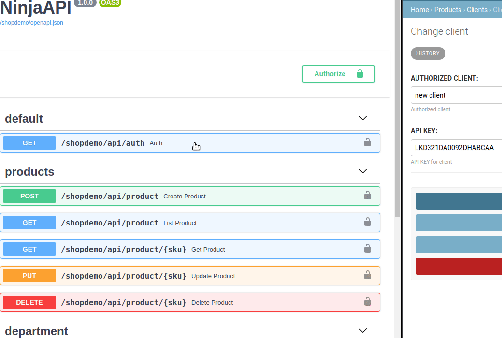
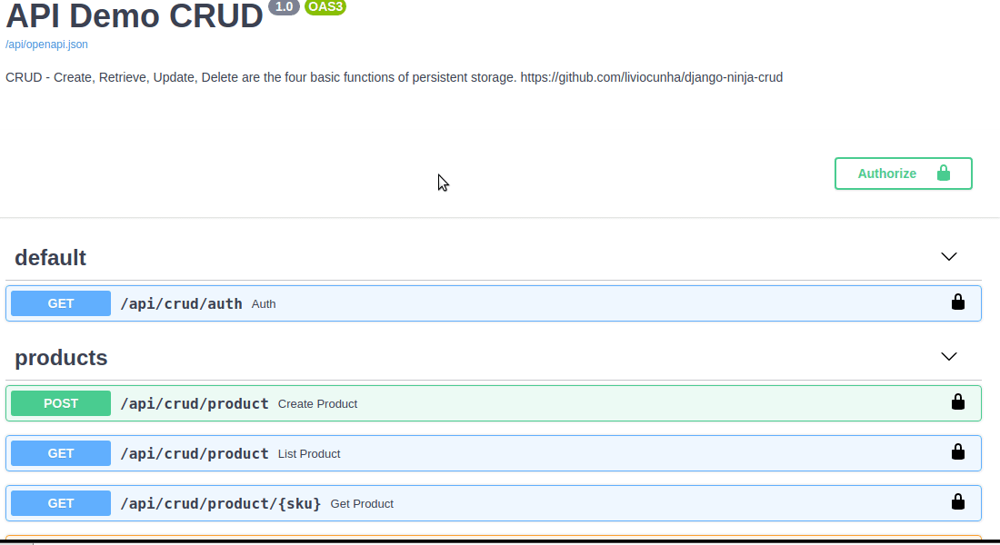
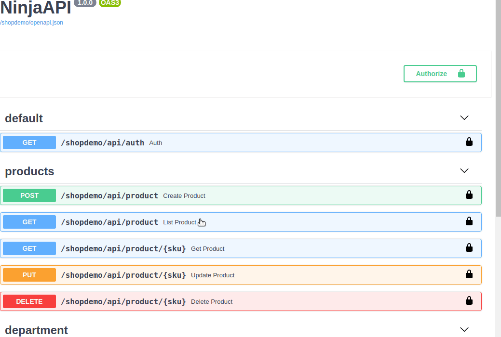
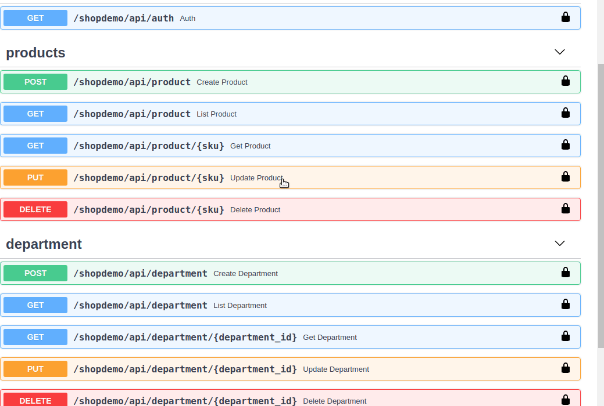
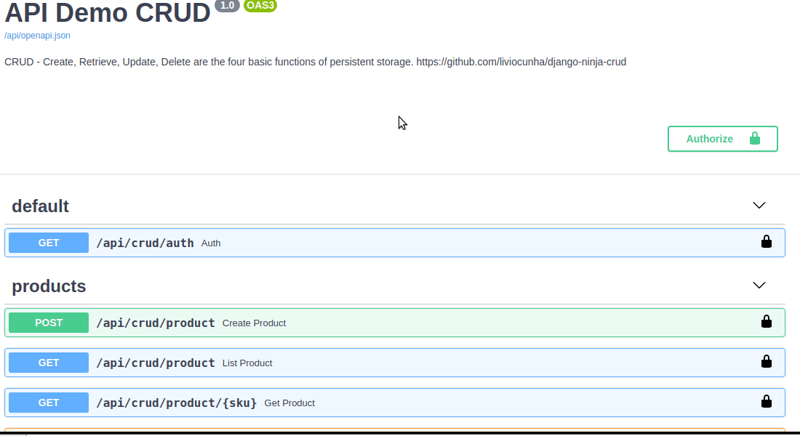

# Example Crud - Django Ninja
## Fast Django REST Framework
CRUD - Create, Retrieve, Update, Delete are the four basic functions of persistent storage.
### Auth - API Key

### Create

### Retrieve (all list)

### Retrieve (get one item)

### Update

### Delete


## This project was done with:
* Python 3.8.5
* Django 3.1.7
* Django Ninja 0.11.0
* python-decouple 3.4

## How to run project?
* Clone this repository.
* Create virtualenv with Python 3.
* Active the virtualenv.
* Install dependencies.
* Run the migrations.
* Create user admin.
```
git clone https://github.com/liviocunha/django-ninja-crud.git
cd django-ninja-crud
python3 -m venv .venv
source .venv/bin/activate
pip3 install -r requirements.txt
python3 manage.py makemigrations core
python3 manage.py migrate
python3 manage.py createsuperuser
python3 manage.py runserver
```
